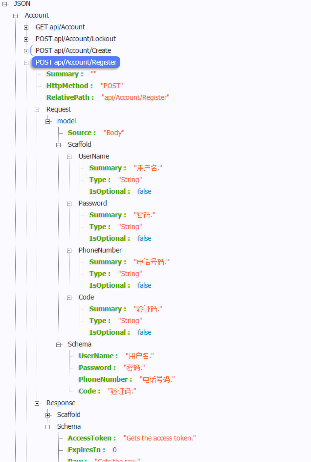
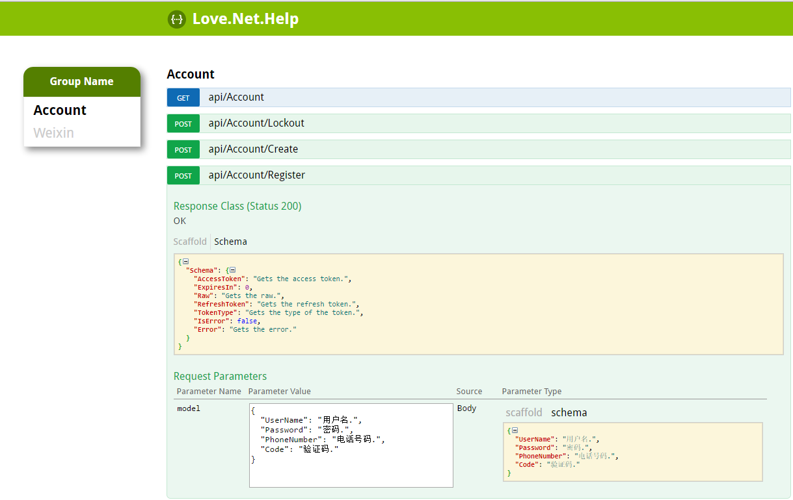

# Love.Net.Help

A generate API documentation toolchain for ASP.NET Core. 

[](https://gitter.im/lovedotnet/Love.Net.Help?utm_source=badge&utm_medium=badge&utm_campaign=pr-badge&utm_content=badge) 

# Features
[x] Read XML comments at run time;
[x] Get **Enum** raw constant value and XML comments;
    e.g.
    ```JSON
    {
      "0": "未知", 
      "1": "男性", 
      "2": "女性"
    }
    ```
[x]  Generate API documentation for ASP.NET Core.

# Overview

If your Chrome had installed `JSON-handle` extension, visit `http://localhost:10571/api/help`, the result will be:



If had configure to use **Love.Net.Help** UI `app.UseApiHelpUI();`, visit `http://localhost:10571/api/help/ui`, the result will be:



# How to use

## Install package

`PM> Install-Package Love.Net.Help`

## Configure Services

Add API help to services `services.AddMvcCore().AddApiHelp()`

```C#
        public void ConfigureServices(IServiceCollection services) {
            services.AddMvcCore()
                .AddJsonFormatters(options => {
                    options.ContractResolver = new DefaultContractResolver();
                }).AddApiHelp();

            services.UseDefaultAccountService<User>(null);
        }

```

## Use **Love.Net.Help** UI `app.UseApiHelpUI();`

```C#
public void Configure(IApplicationBuilder app, IHostingEnvironment env, ILoggerFactory loggerFactory) {
    loggerFactory.AddConsole(Configuration.GetSection("Logging"));
    loggerFactory.AddDebug();

    app.UseApiHelpUI();

    app.UseMvc();
}
```

Browser `http://localhost:10571/api/help/ui`

## Options for API help

```C#
        public void ConfigureServices(IServiceCollection services) {
            services.AddMvcCore()
                .AddJsonFormatters(options => {
                    options.ContractResolver = new DefaultContractResolver();
                }).AddApiHelp(options => {
                    options.IgnoreObsoleteApi = true;
                    options.LoadingPolicy = LoadingPolicy.Eager;
                });

            services.UseDefaultAccountService<User>(null);
        }
```

## Loading specified API help

```
http://localhost:10571/api/help/get?RelativePath=api/Values/{id}&HttpMethod=GET
```

# About UI

The currently impls include a simple UI, so if your team need an UI to improve the usage, **wellcome to contribute** here. We will thank
your work.